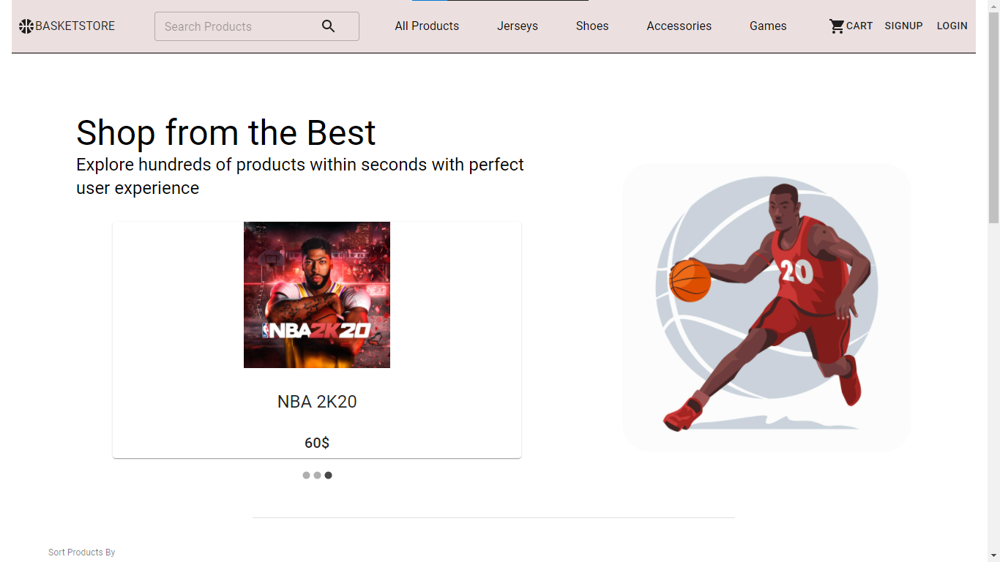
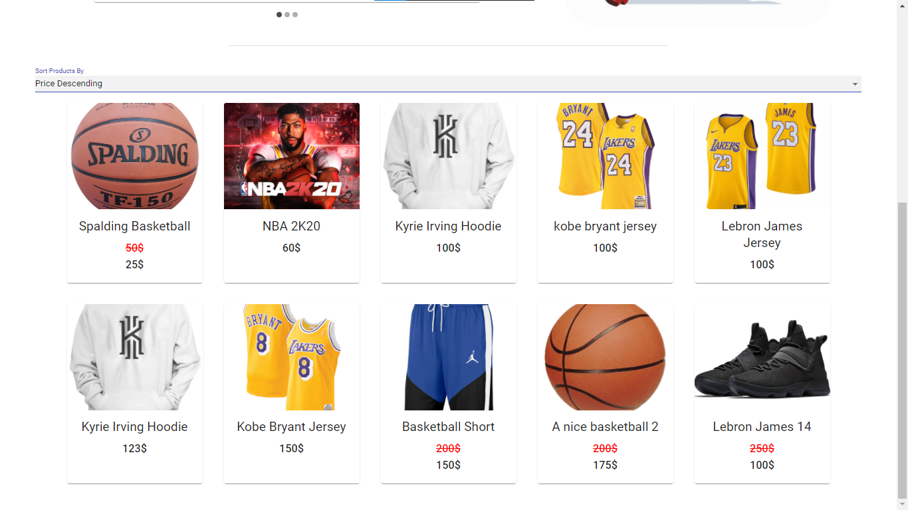
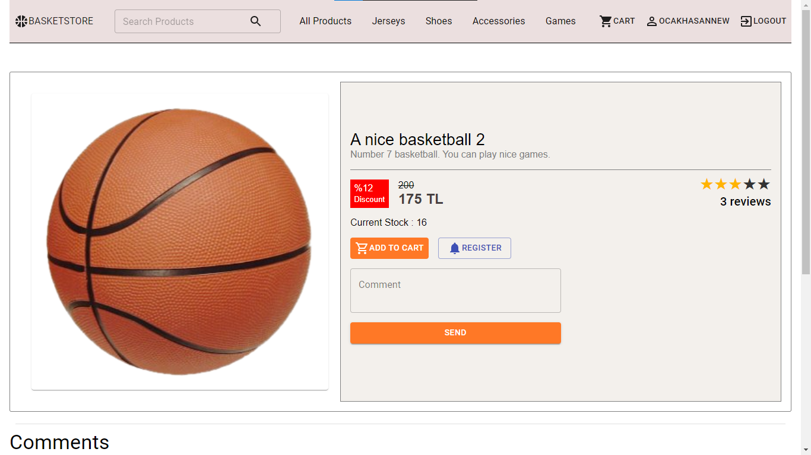
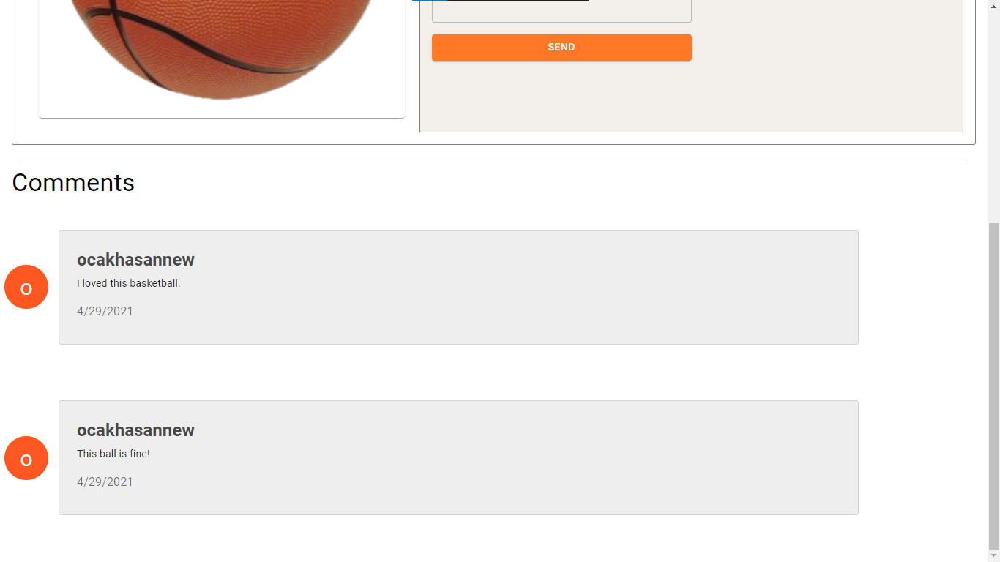
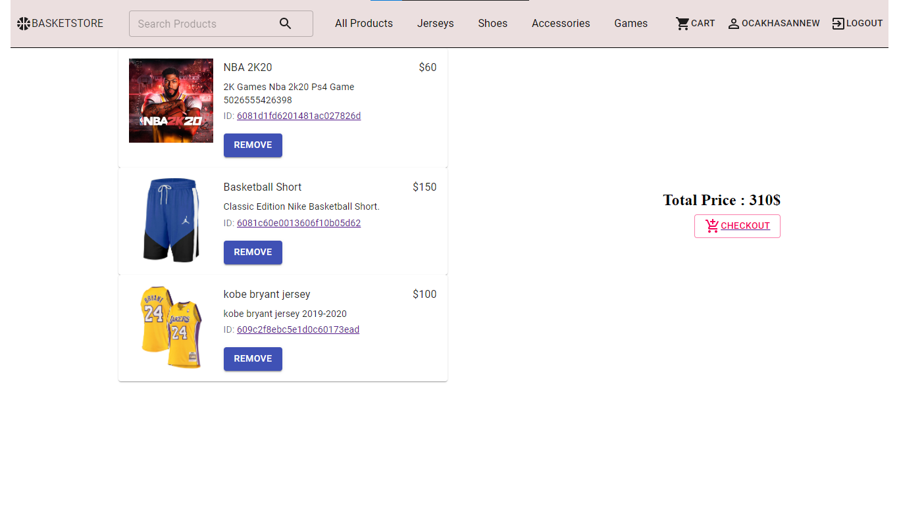
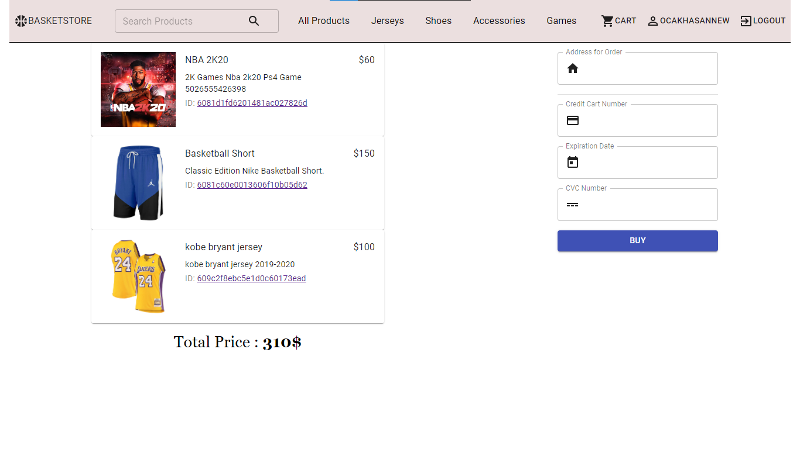
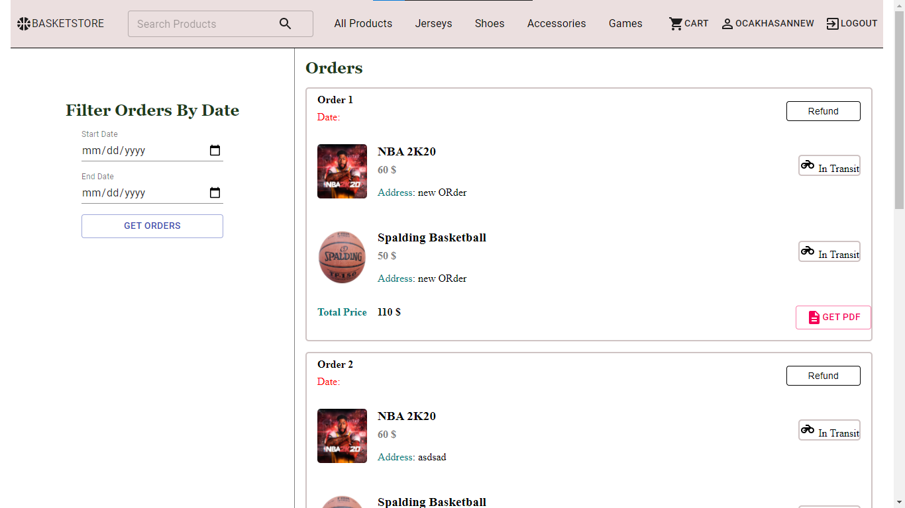
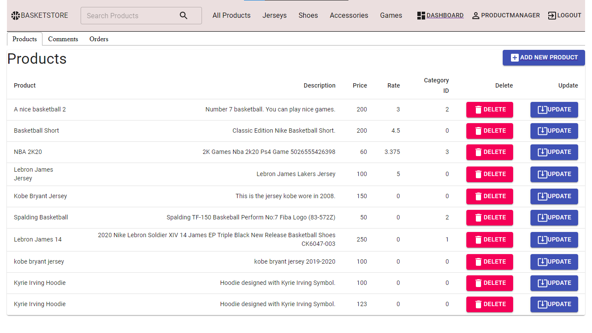
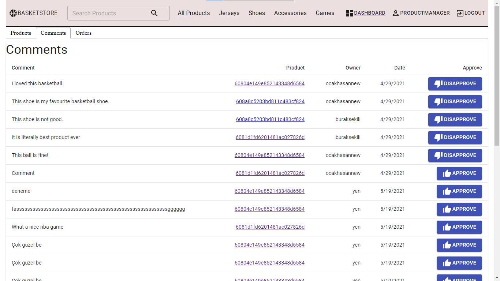
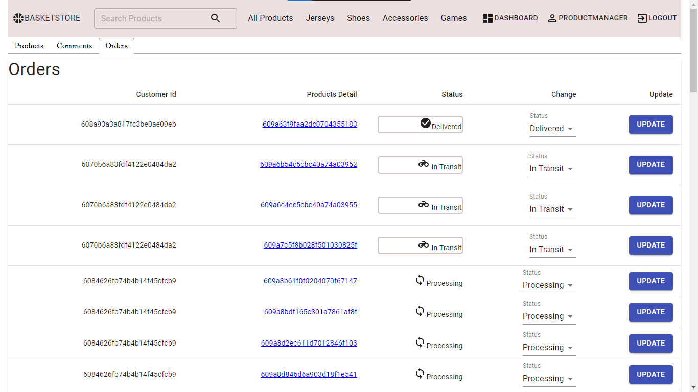

# E-Commerce Basketball Store Frontend


You can see the screenshots of the application from [screenshots](#screenshots) part. 

## What does this project include?
- User creation and authentication
- Sort products by comment count, price and rate. 
- Search and add the products to cart. 
- Comment and rate products
- Register products to be notified when there is a sale
- Email notification service
- Create orders
- Refund mechanism
- User Profile Page
- Add, delete, change products from admin panel
- Manage orders and comments from admin panel

In short terms, this project covers the basics of a e-commerce website. Since me and my co-workers love basketball, we wanted to make this website a basketball-shop. 


## How to run the project
 Install the dependencies with
	```
	> yarn install or npm install

 Then you need to start the server with 
	```
	> yarn start or npm start
	```

Then it will run the project at `localhost:3000` if `3000` is occupied, it will run in `localhost:3001`. If there is any errors when frontend tries to connect to backend (proxy errors), change the proxy to point to backend in `package.json`.


## Screenshots













